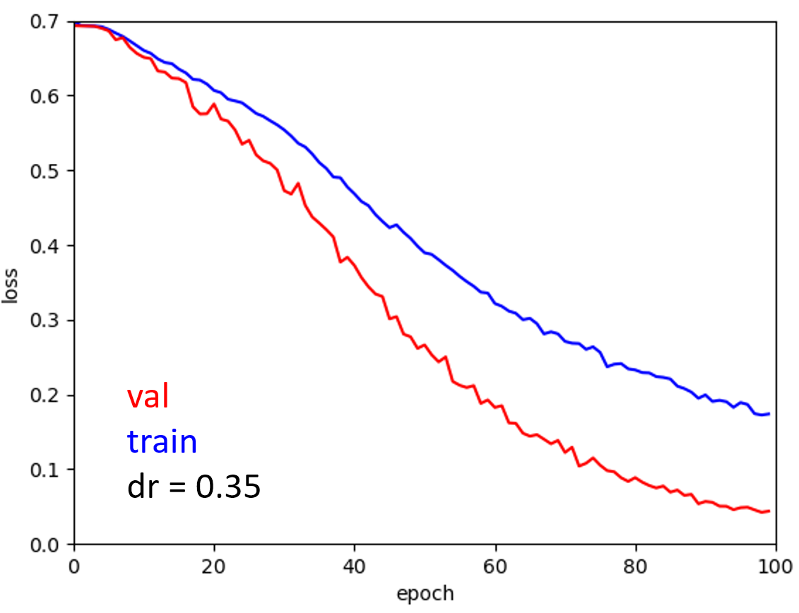
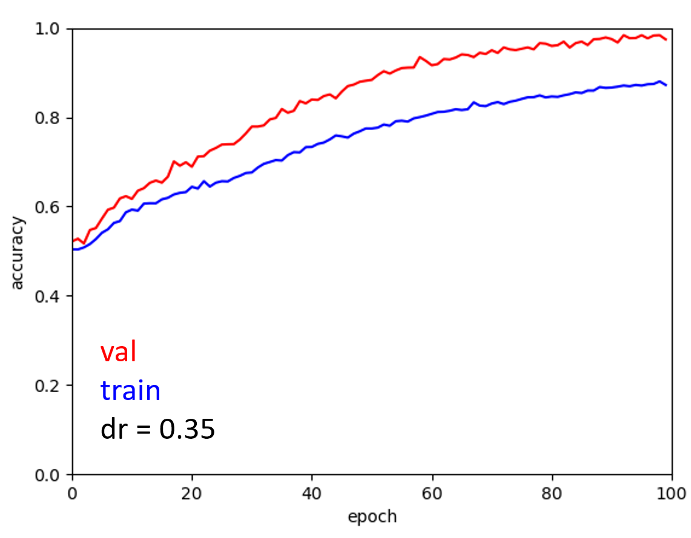
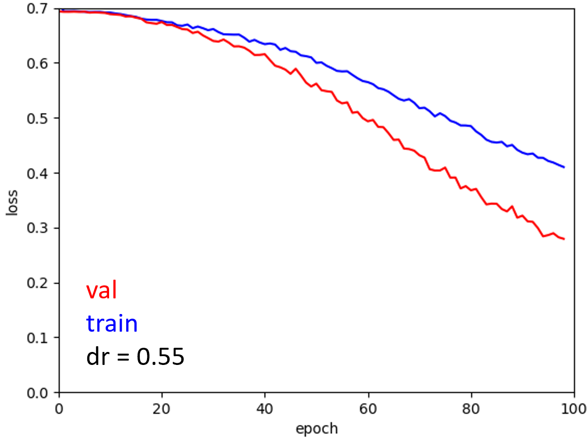

# Can a Convolutional Neural Network do Technical Analysis?

Technical Analysis to predict stock market moves has always looked like astrology to me.  
But TA has quite the large fan base, so there has to be some truth to it, even if by self realisation (if enough people believe that the "cup and handle" will give you a rise in price then you will at some point get some upward pressure).  
Even Burry ultimately relies on supports; in his own words:  
"With the market rallying since just prior to the start of the Strategy Lab, I must admit that many of the stocks I wanted to write about have already appreciated some.
This is problematic because even if I like a stock fundamentally, I am rarely willing to buy more than 15% above technical support.
I also generally use broken support as an exit point."

The idea is then simple, can I feed a few candle charts to a CNN and get has an output if I should buy now or not.  
As I want to have a market neutral strategy, let's reformulate:  
Can I feed the candle charts for 'stock0' and 'stock1' to a CNN and output 0 (1) if stock0 (stock1) outperforms?

## The idea

Let's start by chosing a sector, in our case, residential REIT stocks listed in the US.
We then select the 10 most traded stocks and download the historical data with Open, Close, High, Low and Volume (OCHLV) values for the one hour, one day, and one week candles ([data_extraction.py](data_extraction.py) helps with the task).

We can then translate these OCHLV data into visual candle charts, in the form of torch tensors, as in the figure below ( [you can plot your own](plot_candles.py)). 
And we can stack those tensors for a pair a stock.
Practically, we have the 1h, 1d and 1week andle charts for the pair of stocks so that we end up with 6 channels in pytorch nomenclature.
The height is fixed to 144 pixels (so that at least the height allows 4 2x2 maxpools and/or 2 3x3 ones).
The width will depend on the number of candles we want the CNN to look at.

We can note two things.  
First, if we have 10 stocks, we have 90 possible permutations which is good for training (100 days will give us 9000 tensors to train on).  
Second, the candles have to be scaled to fit in the 'pannel'. The scale is set by the one of the two stocks that varies the most on the periode we look at.
We need to give this scaling factor to the CNN to give it chance at infering the magnitude of the variation.

In a nutshell, the CNN take as input the stack of candles and the scaling values and output 0 or 1 depending on wether stock 0 or stock 1 is the one overperforming over the next 24h.  
And arbitrarily, we always open/close positions at 10:30am at the close of the first 1h candle of the day, this should be considered a parameter, but the parameter space is already enormous.

The achitecture of the network is shown below, you can also ave a look at the [code](neuralnet.py).

## How do we play?

#### We have an [agent](agent.py) with the following characteritics:  
+ A memory to store the stacks of candle charts and the best actions that should be taken for each pair of stocks.
+ A [neural network](neuralnet.py) that he can train against his memory, and use to predict the best action to take 
+ The agent is connected to a [wrapper](wrapper.py) (the 'market') that feeds him the stacks of candle charts.

#### The process is then as follow:
1. The agent observes the stacks of the previous days and the variations of each stocks.  
2. The agent train the neural network against its memory.
3. The agent observes the stacks of the day associated to the 10 stocks (reminder that there are 90 stacks in total for a given day).
4. The agent predict for each pair of stock which one will be outperforming and give one point for the best stock each time.
5. The agent goes long with 50% of its wallet on the stock with the most points and opens an equivalent short position on the stock with the least.
(He could go 100% of the wallet, but let's say he wants to play it safe.)
6. Then he moves on to the next day, close both long and short positions and starts again, pushing one more day in the memory.
The memory may have a maximum length.

## Some obvious flaws

+ Dividends are not taken into account in all of this. And to make things even more sketchy, they are included in yfinance 1d and 1week candles but not in the hourly ones.
+ We are obviously oblivious to any news: unexcpected event, earning days ... (we could maybe avoid holding across earning days to mitigate that).
It is assumed that all the agent orders at bid/ask values equals to the value of the stock at 10:30am reported from yfinance passed, this is not a given.
+ There is of course no consideration on the fundamentals.  
+ The cost of each transaction is 0. Which at the very least can't be the case for a short position.  
+ Market mood varies widely and investor sentiments will change with time. 
Reaction to a given chart won't be the same in September 2021 and March 2022 (the [Fear & Greed Index](https://www.cnn.com/markets/fear-and-greed) is a perfect example).

To mitigate this last issue we will put a limit on the size of the memory and train only the last fully convoluted layer during play time. More details on this are given below.

## Training and (hyper)parameters tuning

The yfinance library allows us to get 730 days worth of 1h candles.  
We can cut this in 250 days for training which is roughly a year of data.
And we can use the rest for testing. This is mostly because training is time consuming and I have a limited amount of time.

Of these 250 days we will take 200 days to train the whole neural network and finetune the hyperparameters and the other ones.
Namely the learning rate, dropout, filter length, but also the holding time and the number of observed candles.
Once again, because of the limited amount of time we will fix the holding time to one day to reduce a bit the parameter space.

#### Pretraining on 200 days

We cut those 200 days into a training and validation set. And we have two options. Either shuffling before cutting the dataset or no. If we don't shuffle beforehand, training and validation will be on different periods of time, and we will be subjected to this shifting investor mood issue stated above. It's interresting to see though the night and day difference with and without shuffling the data.
See below some examples with the loss ploted as a function of the dropout for the shuffled and unshuffled cases. The unshuffled validation data cannot go below ln(2).

By varying randomly the dropout, learning rate and the number of observed candles, [we look for the optimal parameters](hyperparameters_opti.py).
Based on the above right figure, we go for a the highest possible drop rate (dr = 0.55) to introduce as much noise as possible and avoid overfitting on particular features. We will also train another network with a lower dropout rate (dr = 0.35) as 0.55 might be overkill. The same way we also get an optimal learning rate of about 1.5e-4.  
With this settle we now solely vary the number of observed candles and find an optimal number that seems to be around 8.
We can now train our model.

The dropout might be still even too high as the train data underperform the validation one.

#### Playing on 50 days to tune memory

Now we use the 50 remaining days of the year to do a mock play.
The goal here is to optimize the parameters to get the best Sharpe ratio in a more concrete situation.
Here we only train the last fully convoluted layer as the size of the memory will be limited.
The Sharpe ratio is then computed as the mean over the standard deviation of the daily returns times sqrt(50) to give a yearly like Sharpe ratio (even if that's not entirely accurate).
50 days is a short periode of time to evaluate our models. But it takes already 10 minutes per play on the hardware I have.
We could finetune during this step the dropout, learning rate but also the memory size, and the number of epochs for training each day.

## Big leap, test with chosen parameters

MEH.
More tuning with longer holding time and different filter length?
How to get a CNN that is better at generalizing? Scale down or dramattically scale up?
Try to train without shuffle this time and fine tune with this. 
The output is too manichean, if the relative variation between the stocks is negligible (which should happen often?) training will force the NN to chose a side. This favorise fiiting situations that are not interresting.
Let's try to mitigate that.

## Trying to extract relative performance

Relative performance theoretically (but not practically) varies between -infty and +infty.
Transform this into 0,1.
tanh is a good candidate but what whould be the slope?
Naturally the CDF comes to mind.
Gives a optimal projected spacing on the 0,1 interval for all my states.
Indeed if too sharp, all 0 or all 1.
If not enough sharp, all projected on ~0.5.

Let's take the same NN, at the output, two values to which I take the softmax which gives a two values whose some = 1 and that belongs to [0,1]. We can look only at the first of those two.
My loss whould compare this value to the projected relative performance which is also between 0 and 1.
To have a good gradient for my backpropagation during training, I want optimally a loss that will gives me 0 when the softmax is equal to the relative variation and infinity when it's the distance between the two is the largest (i.e. 1).
ln(1-|softmax - projected relative variation|) has all the good properties. 