# Can a Convolutional Neural Network do Technical Analysis?

Technical Analysis to predict stock market moves has always looked like astrology to me.  
But TA has quite the large fan base, so there has to be some truth to it, even if by self-realization (if enough people believe that the "cup and handle" will give you a rise in price then you will at some point get some upward pressure).  
Even Burry ultimately relies on supports; in his own words:  
"With the market rallying since just prior to the start of the Strategy Lab, I must admit that many of the stocks I wanted to write about have already appreciated some.
This is problematic because even if I like a stock fundamentally, I am rarely willing to buy more than 15% above technical support.
I also generally use broken support as an exit point."

The idea is then simple, can I feed a few candle charts to a CNN and get as output if I should buy now or not.  
As I want to have a market neutral strategy, let's reformulate:  
Can I feed the candle charts for 'stock0' and 'stock1' to a CNN and output 0 (1) if stock0 (stock1) outperforms?

## The idea

Let's start by choosing a sector, in our case, residential REIT stocks listed in the US.
We then select the 10 most traded stocks and download the historical data with Open, Close, High, Low and Volume (OCHLV) values for the one hour, one day, and one week candles ([data_extraction.py](data_extraction.py) helps with the task).

We can then translate these OCHLV data into visual candle charts, in the form of torch tensors, as plotted in the figure below ( [you can plot your own](plot_candles.py)). 
And we can stack those tensors for a pair of stocks.
Practically, we have the 1h, 1d and 1week candle charts for the pair of stocks so that we end up with 6 channels in pytorch nomenclature.
The height is fixed to 144 pixels (so that at least the height allows 4 2x2 maxpools and/or 2 3x3 ones).
The width will depend on the number of candles we want the CNN to look at.

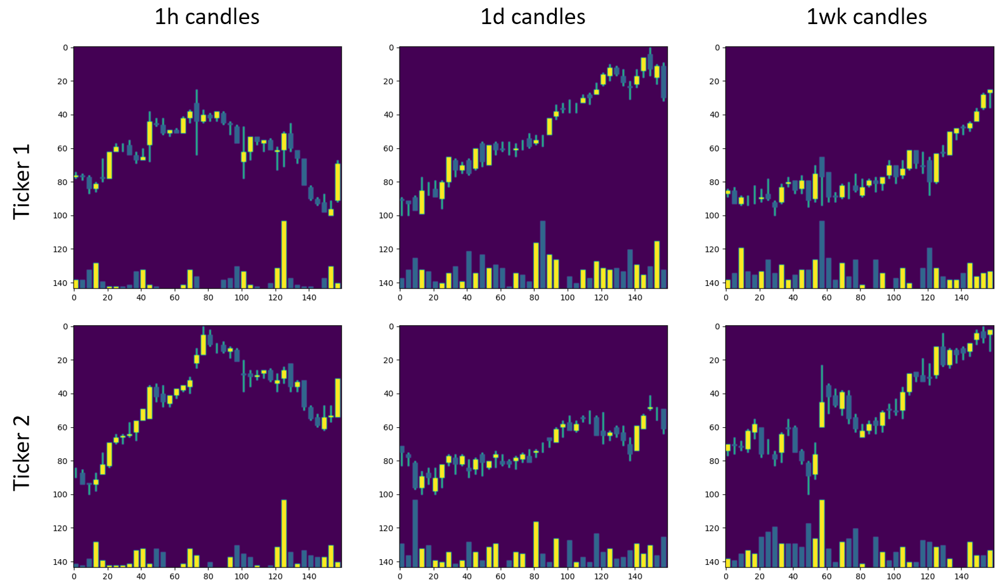
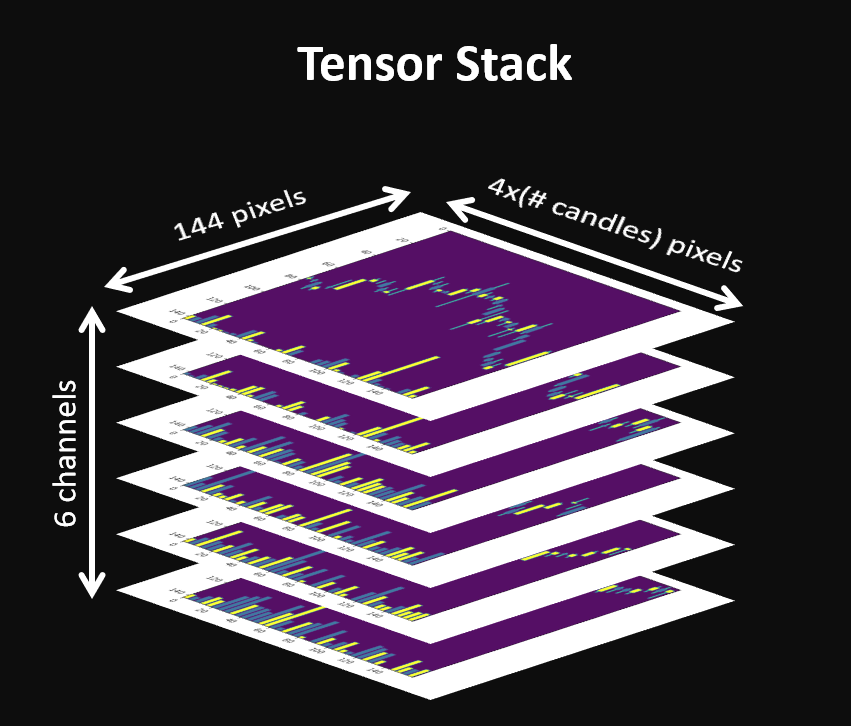

We can note two things.  
First, if we have 10 stocks, we have 90 possible permutations which is good for training (100 days will give us 9000 tensors to train on).  
Second, the candles have to be scaled to fit in the 'panel'. The scale is set by the one of the two stocks that varies the most on the period we look at.
We need to give this scaling factor to the CNN to give it chance at inferring the magnitude of the variation.

In a nutshell, the CNN take as input the stack of candles and the scaling values and output 0 or 1 depending on whether stock 0 or stock 1 is the one overperforming over the next 24h.  
And arbitrarily, we always open/close positions at 10:30am at the close of the first 1h candle of the day, this should be considered a parameter, but the parameter space is already enormous.

The architecture  of the network is shown below, you can also have a look at the [code](neuralnet.py).

## How do we play?

#### We have an [agent](agent.py) with the following characteritics:  
+ A memory to store the stacks of candle charts and the best actions that should be taken for each pair of stocks.
+ A [neural network](neuralnet.py) that he can train against his memory, and use to predict the best action to take 
+ The agent is connected to a [wrapper](wrapper.py) (the 'market') that feeds him the stacks of candle charts.

#### The process is then as follow:
1. The agent observes the stacks of the previous days and the variations of each stocks.  
2. The agent train the neural network against its memory.
3. The agent observes the stacks of the day associated to the 10 stocks (reminder that there are 90 stacks in total for a given day).
4. The agent predict for each pair of stock which one will be outperforming and give one point for the best stock each time.
5. The agent goes long with 50% of its wallet on the stock with the most points and opens an equivalent short position on the stock with the least.
(He could go 100% of the wallet, but let's say he wants to play it safe.)
6. Then he moves on to the next day, close both long and short positions and starts again, pushing one more day in the memory.
The memory may have a maximum length.

## Some obvious flaws

+ Dividends are not taken into account in all of this. And to make things even more sketchy, they are included in yfinance 1d and 1week candles but not in the hourly ones.
+ We are obviously oblivious to any news: unexpected event, earning days ... (we could maybe avoid holding across earning days to mitigate that).
It is assumed that all the agent orders at bid/ask values equals to the value of the stock at 10:30am reported from yfinance passed, this is not a given.
+ There is of course no consideration on the fundamentals.  
+ The cost of each transaction is 0. Which at the very least can't be the case for a short position.  
+ Market mood varies widely and investor sentiments will change with time. 
Reaction to a given chart won't be the same in September 2021 and March 2022 (the [Fear & Greed Index](https://www.cnn.com/markets/fear-and-greed) is a perfect example).

To mitigate this last issue, we will put a limit on the size of the memory and train only the last fully convoluted layer during play time. More details on this are given below.

## Training and (hyper)parameters tuning

The yfinance library allows us to get 730 days' worth of 1h candles.  
We can cut this in 250 days for training which is roughly a year of data.
And we can use the rest for testing. This is mostly because training is time consuming and I have a limited amount of time.

Of these 250 days we will take 200 days to train the whole neural network and finetune the hyperparameters and the other ones.
Namely the learning rate, dropout, filter length, but also the holding time and the number of observed candles.
Once again, because of the limited amount of time we will fix the holding time to one day to reduce a bit the parameter space.

#### Pretraining on 200 days

We cut those 200 days into a training and validation set. And we have two options. Either shuffling before cutting the dataset or no. If we don't shuffle beforehand, training and validation will be on different periods of time, and we will be subjected to this shifting investor mood issue stated above. It's interresting to see though the night and day difference with and without shuffling the data.
See below some examples with the loss plotted as a function of the dropout for the shuffled and unshuffled cases. The unshuffled validation data cannot go below $\ln(2)$.

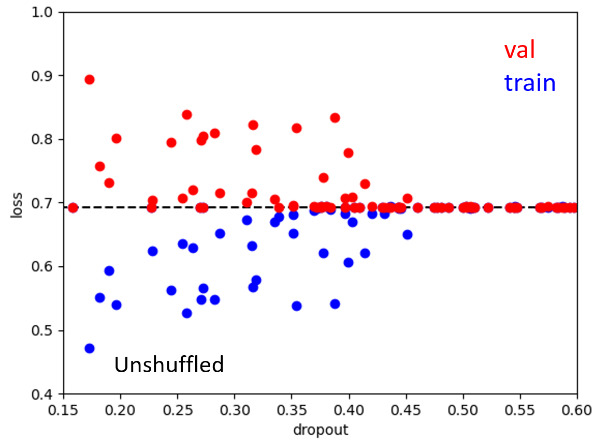
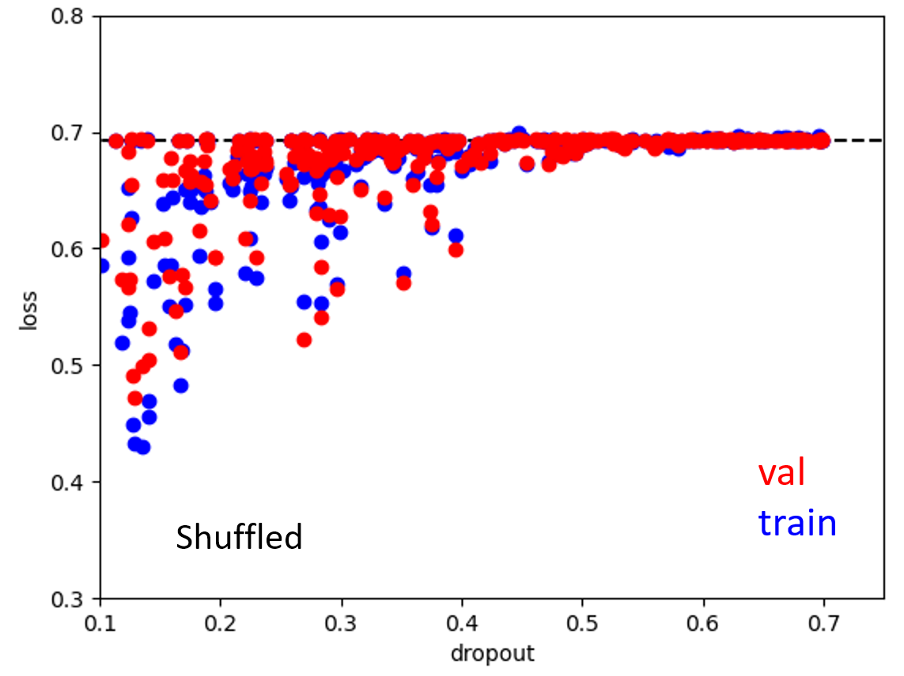

By varying randomly the dropout, learning rate and the number of observed candles, [we look for the optimal parameters](hyperparameters_opti.py).
Based on the above right figure, we go for the highest possible drop rate (dr = 0.55) to introduce as much noise as possible and avoid overfitting on particular features. We will also train another network with a lower dropout rate (dr = 0.35) as 0.55 might be overkill. The same way we also get an optimal learning rate of about 1.5e-4.  
With this settle we now solely vary the number of observed candles and find an optimal number that seems to be around 8.
We can now train our model.

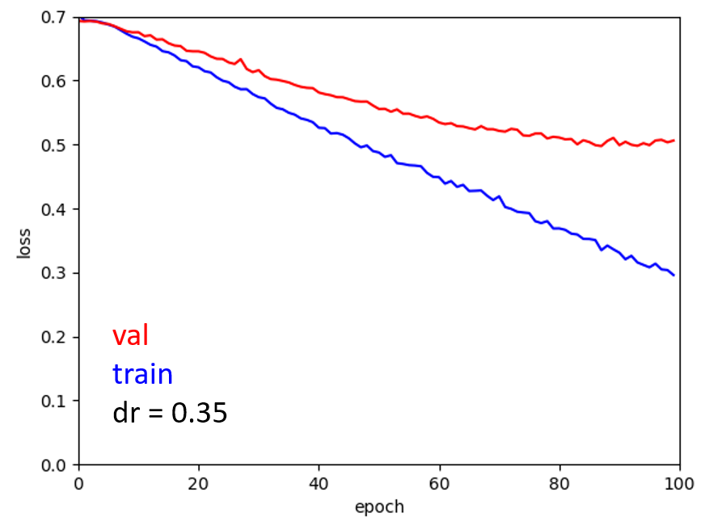
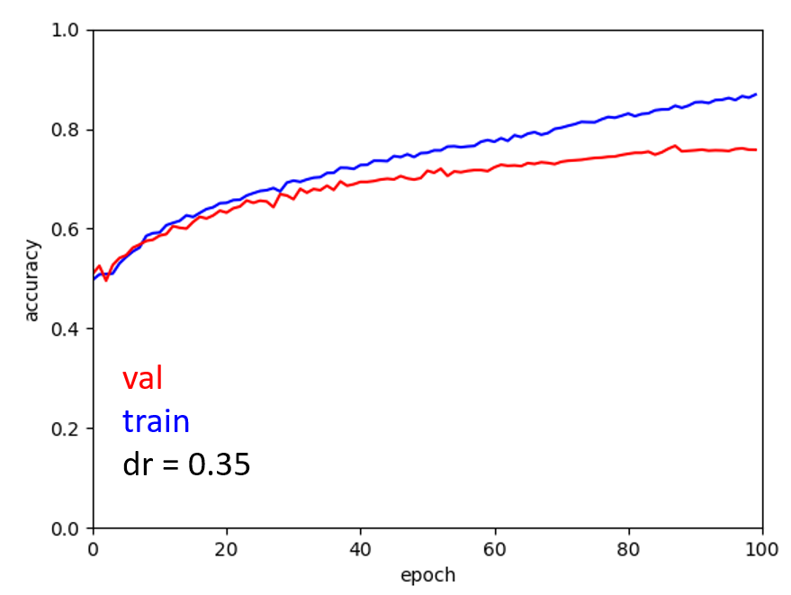

#### Playing on 50 days to tune memory

Now we use the 50 remaining days of the year to do a mock play (see [script](trading_opti.py)).
The goal here is to optimize the parameters to get the best Sharpe ratio in a more concrete situation.
This time, we only train the last fully convoluted layer as the size of the memory will be limited.
The Sharpe ratio is then computed as the mean over the standard deviation of the daily returns times $\sqrt{50}$ to give a yearly like Sharpe ratio (even if that's not entirely accurate).
50 days is a short period of time to evaluate our models. But it takes already 10 minutes per play on the hardware I have.
We could finetune during this step the dropout, learning rate but also the memory size, and the number of epochs for training each day.

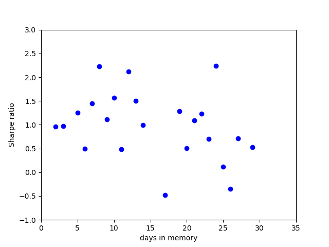

The data (which is here aggregated and averaged for each x axis value) is extremely noisy, maybe because of the short 50 days period.
Some run showed satisfying Sharpe ratios above 2, but it can be luck, given the noise.
All in all keeping 15 days in memory might be a reasonnable.
It's quite noteworthy that the Sharpe ratio declines with increasing memory size.
The decline after 15 days may hint at a typical time scale of 3 weeks for market mood? But once again the noise level is quite high here.

## Big leap, test with chosen parameters

Finaly we set our tuned parameters and start to play.
We use both pretrained models with dropout rates of 0.35 and 0.55.
These where retrained on the whole 250 days training set.
The code for the final test is [here](final_test.py).
The result is shown below.

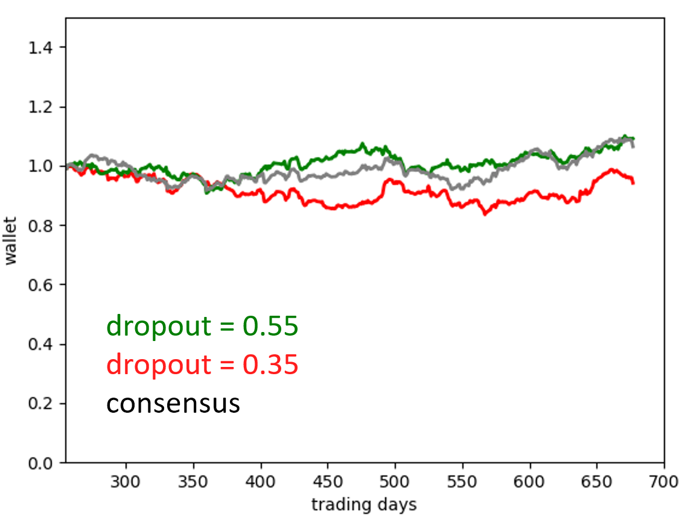

It is quite anticlimactic. It is still interesting to see that the network trained with the larger dropout has a (very) slight edge.

Now one can wonder what could have been done better.
We could go back to the first step and test way more to get more statistic. Particularly in the second training phase, using a time span of a year should help.
Playing with the other parameters could also help (holding time, filter length ...).
Using another architecture is another avenue, by either scaling down or scaling up to avoid overfitting (seems that both can work).

Now the maybe more obvious issue is that the output of the CNN is too Manichean.
If the relative variation between the stocks is small training will still force the NN to choose a side and that might be detrimental. We want the neuralnet to be undecided when variation is small and certain when variation is large.
We can try to address that problematic by outputting the relative variation between the stocks instead of the best action to take.

## Predicting relative performance

Let's call $\Delta x = x_1 - x_0$ the relative variation between stocks 1 and 0. With $x_1$ and $x_0$ the variations of stocks 1 and 0.
In principle, $\Delta x$ is in the interval $[-\infty, +\infty]$.
This is not a great range for a neural network output, we hence need to project it to the $[0,1]$ interval.
We can use a $P(\Delta x) = 1/2 \times (1 + \tanh(slope\times \Delta x))$ for this purpose, but what about the slope?
If the slope is too steep, all projections will be either 0 or 1. If it's too gentle then all projections will be close to 0.5.

We should compare our function with the cumulative distribution function of the relative daily variation between two stocks. Of course, it will vary depending on the pair of stocks chosen. A slope of 10 gives us a good starting point and let us the hope to find variations in the -0.1, 0.1 range. We can vary that parameter around that later on. The figure below compares that function with the CDF of the relative daily variation on 4 pairs of stocks.

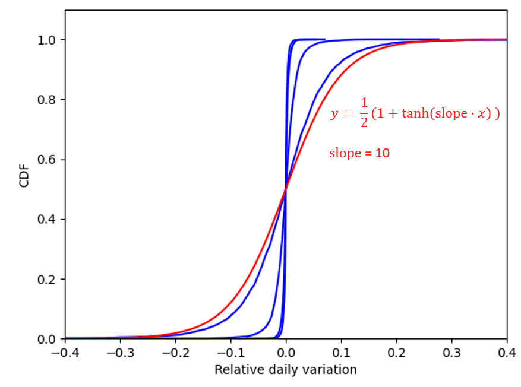

We can take the same NN, and apply a softmax to the output to get a value that belongs to [0,1]. We can then compare this value to the real $\Delta x$ which is also between 0 and 1.
We want optimally a loss that will gives us 0 when the softmax is equal to the relative variation and infinity when the distance between the two is the largest (i.e. 1). Taking the log,
$-\ln(1-|prediction - P(\Delta x)|)$ we get all the good properties.

We can implement a variant of the agent in [agent_variation.py](agent_variation.py) with the custom loss function and the two function $P(\Delta x)$ and $P^{-1}(\Delta x)$ that will allow us to go back and forth between the convenient space $[0,1]$ for our CNN and the 'relative variation' space that has better meaning to us. The [adapted wrapper](wrapper_variation.py) now returns the relative variation between a pair of stocks instead of the 0,1 logit to indicate which stock will increase the most.

### Hyperparameters tuning

We can start by tuning the hyper parameters. We apply the same procdure, chosing random values of learning rate, dropout and slope at each iteration.

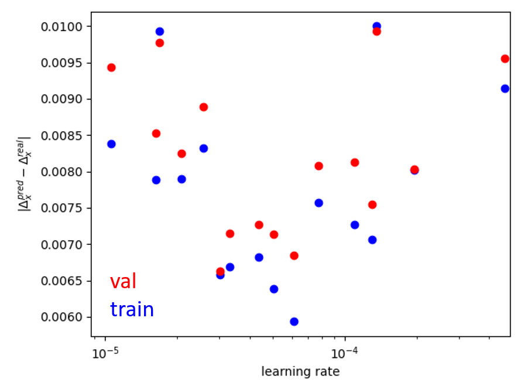
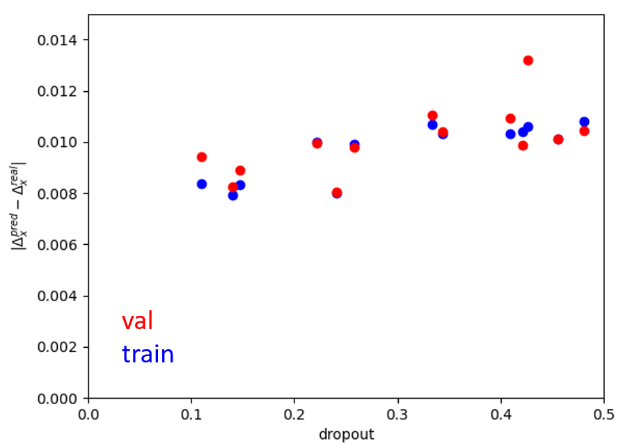
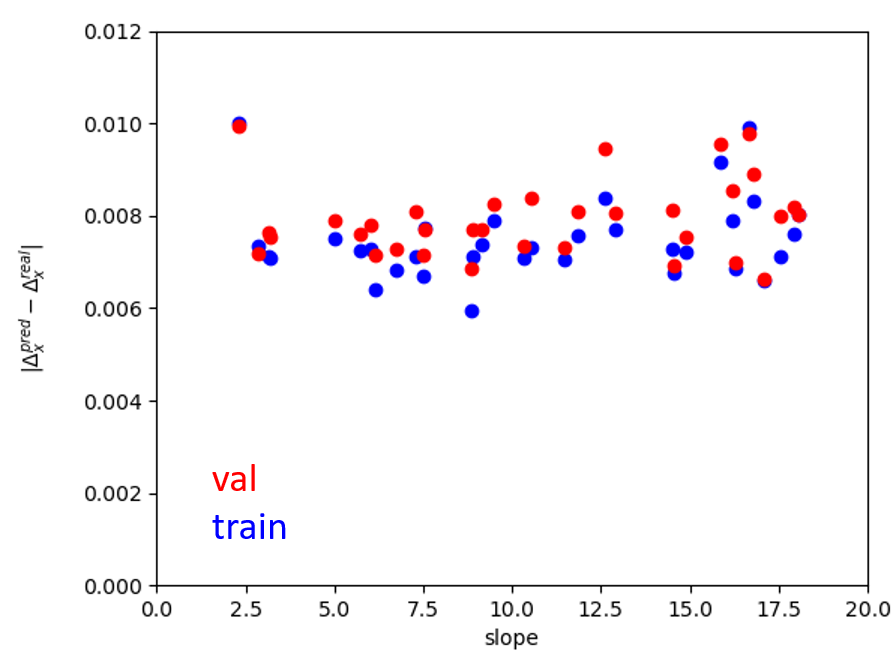

We chose a learning rate of $5.5 10^{-5}$ dropout of 0.20 and a slope of 8.